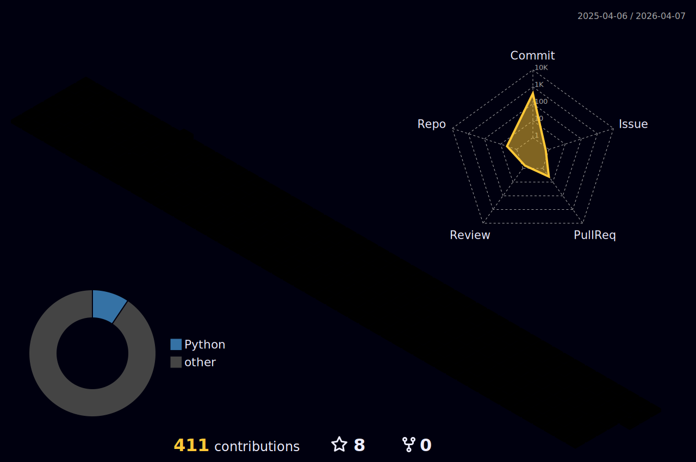

### 👋 반갑습니다!  
<h2 align="center" 항상 도전하며 상상을 현실로 만드는, <b>성장하는 개발자 장규진</b>입니다  </h2>
  

* 💻 아직 배울게 많은 AI 엔지니어입니다.
* 🦾 대용량 데이터 관련 NLP에 관심이 많습니다.
* 😎 나만의 일을 찾기위해 열심히 노력중입니다.

  

  

  

# 💪Skills
### Platforms & Languages

  

# 🔨Tools

  

# :mailbox_with_mail: Contacts

