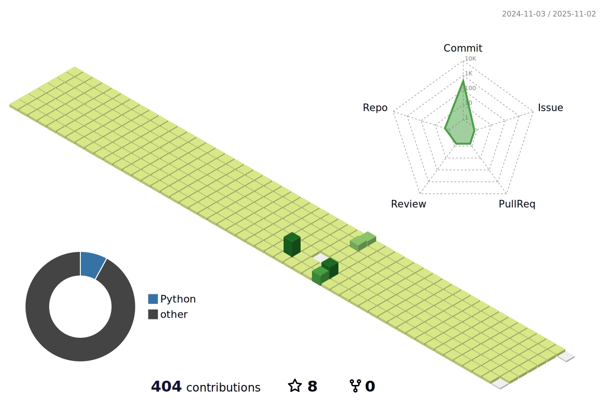

  
# ✨ KyuJin's git ✨
<h3 align="center"항상 도전하며 <b>상상을 현실로</b> 만드는, 기록하는 개발자 <b>장규진</b>입니다.  </h3>
  

  

  

# 💪Skills
### Platforms & Languages

  

# Tools

  

# :mailbox_with_mail: Contacts

